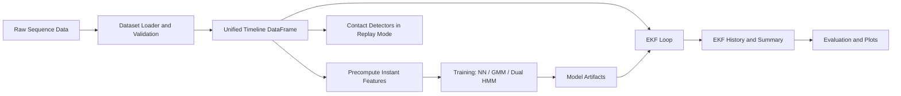

# Leg Odometry Framework

Leg Odometry Framework is a research-oriented toolkit for quadruped state estimation with an error-state EKF, contact inference, and optional learned contact models.

The project supports two dataset products today:
- `tartanground` for ANYmal sequence logs,
- `ocelot` for Unitree Go2 lowstate-style logs converted to project CSV format.

### TartanGround
To download `TartanGround` dataset, check the Readme under `data/tartanground`.


## Goal and Scope

Goal:
- estimate base motion from onboard sensing using IMU propagation plus contact-aware ZUPT updates,
- provide a reproducible pipeline for detector development and EKF evaluation.

Scope:
- sequence loading and validation,
- kinematics-backed contact feature extraction,
- contact detectors (threshold, statistical, neural),
- EKF process loop and evaluation outputs.

## Repository Map

| Path | Role |
| ---- | ---- |
| [`leg_odom/`](leg_odom/) | Main library: datasets, IO, kinematics, contact, filters, training, eval, run orchestration |
| [`config/`](config/) | Experiment templates and parameter reference |
| [`docs/`](docs/) | Design notes and diagrams |
| [`examples/`](examples/) | Shell examples for common workflows |
| [`main.py`](main.py) | Main experiment entrypoint |
| [`requirements.txt`](requirements.txt) | Core dependencies |
| [`requirements-nn.txt`](requirements-nn.txt) | Optional neural/training dependencies |

## End-to-End Data Flow



## Installation

### 1) Create and activate environment

```bash
conda create -n leg-odometry python=3.10 -y
conda activate leg-odometry
```

### 2) Install dependencies

```bash
pip install -r requirements.txt
```

Optional neural/training stack:

```bash
pip install -r requirements-nn.txt
```

### 3) Quick import check

```bash
python -c "import leg_odom.contact, leg_odom.filters, leg_odom.run"
```

## Data Preparation (Template)

This section is intentionally a template and can be expanded with project scripts later.

### Tartanground (ANYmal)

Planned workflow:
1. Download raw Tartanground logs.
2. Run project scripts to produce processable CSV layout.
3. Set `dataset.kind: tartanground` and `dataset.sequence_dir` in experiment YAML.

### Ocelot (Unitree Go2)

Planned workflow:
1. Convert Ocelot-style logs to project CSV layout.
2. Validate generated sequence folder structure.
3. Set `dataset.kind: ocelot` and `dataset.sequence_dir` in experiment YAML.

## Preprocessing for Training

If you plan to train neural or statistical contact models, preprocessing is required.

Purpose:
- compute per-timestep instant features,
- generate training-ready bundles (`precomputed_instants.npz`) organized by sequence,
- keep training pipelines consistent across dataset kinds.

See preprocessing details and config examples in:
- [`leg_odom/features/README.md`](leg_odom/features/README.md)

Example command:

```bash
python -m leg_odom.features.precompute_contact_instants \
   --config leg_odom/features/default_precompute_config.yaml
```

## Training Contact Models

If using `neural`, `gmm`, or `dual_hmm` contact detectors, you typically train models first.
You can also use provided model artifacts when available.

Current model artifact location is under [`leg_odom/training/`](leg_odom/training/) (subject to future reorganization).

Training guide and examples:
- [`leg_odom/training/README.md`](leg_odom/training/README.md)

Typical commands:

```bash
python -m leg_odom.training.nn.train_contact_nn --config leg_odom/training/nn/default_train_config.yaml
python -m leg_odom.training.gmm.train_gmm --precomputed-root <precomputed_root>
python -m leg_odom.training.dual_hmm.train_dual_hmm --precomputed-root <precomputed_root>
```

## Run Contact Detectors Without EKF

You can run detector replay and visualization directly on a sequence without the EKF loop.

Standalone detector usage guide:
- [`leg_odom/contact/README.md`](leg_odom/contact/README.md)

Examples:

```bash
python -m leg_odom.contact.grf_threshold --help
python -m leg_odom.contact.gmm_hmm.visualize --help
python -m leg_odom.contact.dual_hmm.visualize --help
```

## Run the EKF Loop

Main command:

```bash
python main.py --config config/default_experiment.yaml
```

### Key config sections

| Section | Meaning |
| ------- | ------- |
| `run.*` | run naming and debug behavior |
| `dataset.kind` | dataset loader type (`tartanground` or `ocelot`) |
| `dataset.sequence_dir` | one sequence folder: absolute path, or path relative to the repo (directory with `main.py`) |
| `robot.kinematics` | kinematics backend (`anymal` or `go2`) |
| `contact.detector` | detector selection (`grf_threshold`, `gmm`, `dual_hmm`, `neural`, `ocelot`) |
| `ekf.*` | filter and noise configuration |
| `output.*` | output root and timestamp behavior |

Full parameter reference:
- [`config/experiment_parameters_reference.yaml`](config/experiment_parameters_reference.yaml)

## Output Structure

A run writes outputs under:

```text
{output.base_dir}/output_{run.name}/{dataset.kind}/{parent_sequence_dir_name}/{sequence_slug[_timestamp]}/
```

Typical artifacts:
- `experiment_resolved.yaml`: validated config snapshot used for the run,
- `ekf_process_summary.json`: run summary metadata,
- `ekf_history_<sequence>.csv`: per-step EKF state/contact diagnostics,
- `plots/`: analysis figures and evaluation CSV/PNG artifacts.

## Related READMEs

- [`examples/README.md`](examples/README.md)
- [`leg_odom/features/README.md`](leg_odom/features/README.md)
- [`leg_odom/training/README.md`](leg_odom/training/README.md)
- [`leg_odom/contact/README.md`](leg_odom/contact/README.md)
