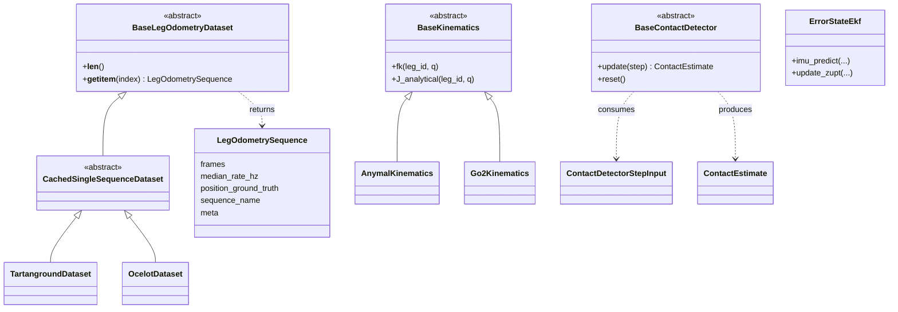
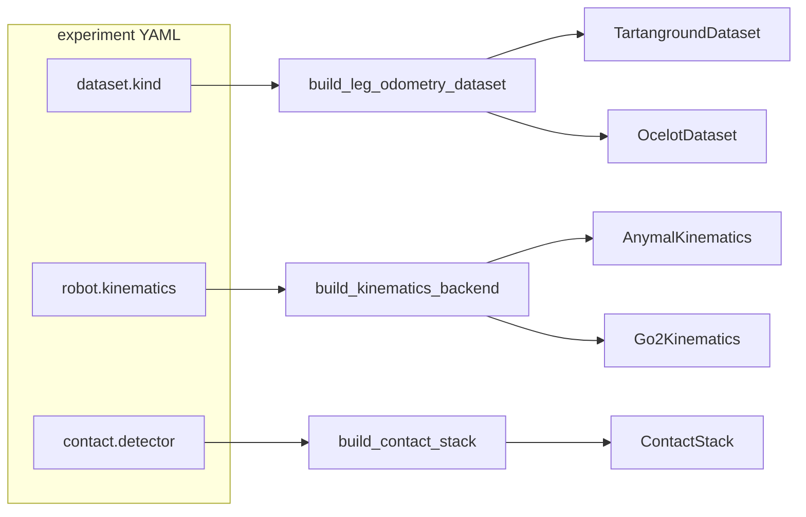
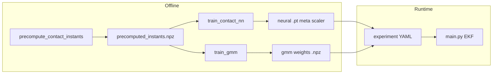

# Leg odometry: class and dependency diagrams

Mermaid diagrams for the **`leg_odom`** package. For folder-level narrative, see [ARCHITECTURE.md](../ARCHITECTURE.md). **Submodule-focused UML:** [features](../leg_odom/features/README.md#uml-class-diagrams-mermaid), [training](../leg_odom/training/README.md#uml-class-diagrams-mermaid), [contact](../leg_odom/contact/README.md#uml-class-diagrams-mermaid).

## Core classes (simplified UML)

Concrete detectors include GRF threshold, GMM+HMM, and neural classifiers implementing `BaseContactDetector`.

## Run-time factories (experiment YAML)

## Data pipeline: precompute, training, EKF

**Independent path:** `contact.detector: grf_threshold` needs no precompute or training artifacts.
