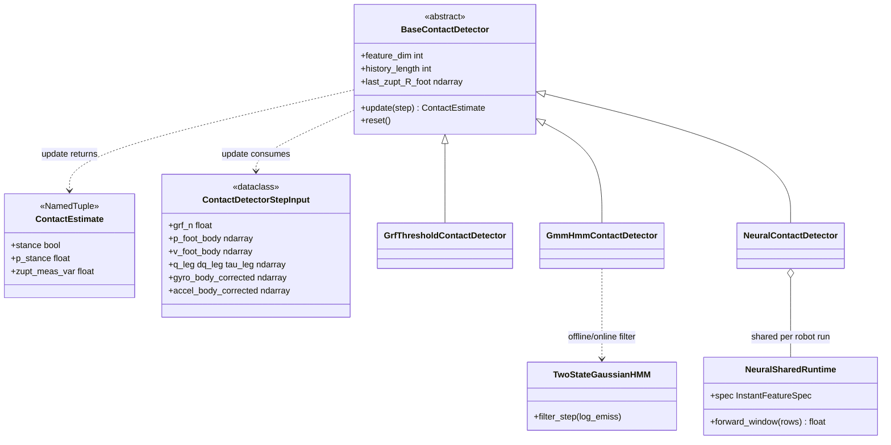

# Contact detection

**Contact inference** estimates stance probability (and ZUPT measurement noise) per foot for the EKF. Implementations subclass **`BaseContactDetector`** and consume **`ContactDetectorStepInput`** per timestep (kinematics + IMU + GRF, etc.).

The EKF builds detectors via [`leg_odom/run/contact_factory.py`](../run/contact_factory.py) from experiment YAML. The **same** detector classes and **replay** utilities are used by training label pipelines and optional visualization CLIs **without** running the full EKF loop.

## UML class diagrams (Mermaid)

**Types and detector hierarchy**



**Replay helpers** — [`replay_timeline.replay_detectors_on_timeline`](replay_timeline.py) runs a list of `BaseContactDetector` instances over a merged timeline (no class diagram: functions + `pandas.DataFrame`).

Full-package UML: [docs/CLASS_DIAGRAM.md](../../docs/CLASS_DIAGRAM.md).

## Core API

| Module | Role |
| ------ | ---- |
| [`base.py`](base.py) | `BaseContactDetector`, `ContactDetectorStepInput`, `ContactEstimate`, ZUPT helper. |
| [`replay_timeline.py`](replay_timeline.py) | Run a list of detectors over a merged `DataFrame` + kinematics (used by EKF tooling, training labels, CLIs). |
| [`grf_stance_plot.py`](grf_stance_plot.py) | Matplotlib GRF / stance overview (shared by CLIs and `train_gmm` plot). |

## Concrete detectors

| Detector | Module / package | Typical YAML `contact.detector` |
| -------- | ---------------- | ------------------------------- |
| GRF threshold | [`grf_threshold.py`](grf_threshold.py) | `grf_threshold` |
| GMM + HMM | [`gmm_hmm/`](gmm_hmm/) | `gmm` |
| Neural (CNN/GRU) | [`neural.py`](neural.py) | `neural` |
| Dual HMM / Ocelot | [`dual_hmm_fusion.py`](dual_hmm_fusion.py), [`ocelot.py`](ocelot.py) | Stubs / future |

**Neural** weights come from [`leg_odom.training.nn.train_contact_nn`](../training/nn/train_contact_nn.py); **GMM** npz from [`leg_odom.training.gmm.train_gmm`](../training/gmm/train_gmm.py). **GRF threshold** uses only merged logs (no precompute).

## Standalone scripts (no EKF `main.py`)

These load **one sequence** via `build_leg_odometry_dataset`, build kinematics, run **replay**, and plot:

### GRF threshold visualization

```bash
python -m leg_odom.contact.grf_threshold --help
```

Notable args: `--sequence-dir`, `--dataset-kind` (`tartanground` or `ocelot`), `--robot-kinematics`, `--force-threshold`, `--save` (PNG path; empty = interactive).

### GMM + HMM visualization

```bash
python -m leg_odom.contact.gmm_hmm.visualize --help
```

Notable args: `--sequence-dir`, `--dataset-kind`, `--robot-kinematics`, `--mode` (`offline` / `online`), `--pretrained-path` (required for `online`), `--feature-fields`, `--history-length`, `--save`.

**Offline** mode fits from the loaded recording; **online** loads a pretrained `.npz` from training.

## Relationship to the EKF

1. **Experiment YAML** selects `contact.detector` and nested options.
2. [`contact_factory`](../run/contact_factory.py) instantiates per-leg detectors.
3. [`leg_odom/run/ekf_process.py`](../run/ekf_process.py) calls `update(step)` each IMU step and applies ZUPT when stance is asserted.

Running the CLIs above **does not** produce `ekf_history_*.csv`; they only validate detector behavior on raw data.

## Related documentation

- [Training README](../training/README.md) — producing GMM/NN weights.
- [Repository README](../../README.md) — full EKF run and outputs.
- [ARCHITECTURE.md](../../ARCHITECTURE.md) — factory keys and detector modes table.
- [CLASS_DIAGRAM.md](../../docs/CLASS_DIAGRAM.md) — datasets, kinematics, factories, pipeline flow.
