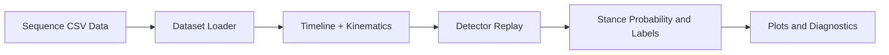

# Contact Detector Guide

This module contains contact detectors and standalone replay utilities.

Use these tools when you want to inspect detector behavior without running the EKF loop.

## Detector-Only Flow



## Available Detector Families

| Detector | Typical Runtime Key |
| -------- | ------------------- |
| GRF threshold | `grf_threshold` |
| GMM + HMM | `gmm` |
| Neural detector | `neural` |
| Dual HMM | `dual_hmm` |
| Ocelot detector | `ocelot` |

## Run Without EKF

### GRF threshold replay

```bash
python -m leg_odom.contact.grf_threshold --help
```

### GMM replay visualization

```bash
python -m leg_odom.contact.gmm_hmm.visualize --help
```

### Dual HMM replay visualization

```bash
python -m leg_odom.contact.dual_hmm.visualize --help
```

These scripts allow detector inspection on a sequence timeline and generate diagnostic plots.

## Typical Inputs

Standalone detector scripts usually require:
- sequence path,
- dataset kind (`tartanground` or `ocelot`),
- robot kinematics backend,
- detector-specific options (for example pretrained path or mode).

## Typical Outputs

Detector-only runs produce plot artifacts and contact diagnostics.
They do not run the EKF process loop and do not produce EKF history CSV.

## Relationship to Training

`gmm`, `dual_hmm`, and `neural` workflows often use artifacts produced by training scripts.

See:
- [`../training/README.md`](../training/README.md)

## Relationship to Full EKF

For full trajectory estimation with contact fusion in the filter loop, use:
- [`../../README.md`](../../README.md)

The main EKF flow is executed via [`../../main.py`](../../main.py) with experiment YAML.
