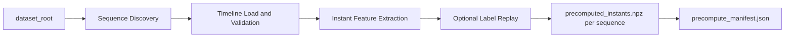

# Preprocessing (Features) Guide

This module provides the preprocessing stage used before model training.

Preprocessing builds per-sequence feature bundles from dataset CSV timelines so training jobs can run on standardized inputs.

## Goal

Preprocessing exists to:
- compute instant feature vectors per leg,
- generate reproducible `.npz` bundles for training,
- keep Tartanground and Ocelot training inputs aligned to one schema.

## Preprocessing Flow



## Entry Point

```bash
python -m leg_odom.features.precompute_contact_instants --config <precompute_config.yaml>
```

## Example Configs

Start from:
- [`default_precompute_config.yaml`](default_precompute_config.yaml)

This config demonstrates:
- dataset selection (`dataset_kind: tartanground|ocelot`),
- robot kinematics selection (`robot: anymal|go2`),
- output root for generated bundles,
- label generation strategy (`labels.method`).

## Important Config Fields

| Field | Description |
| ----- | ----------- |
| `dataset_root` | Root directory to scan for sequence folders |
| `output_root` | Destination root for generated `.npz` bundles |
| `dataset_kind` | `tartanground` or `ocelot` |
| `robot` | `anymal` or `go2` |
| `labels.method` | Label source used during preprocessing |
| `overwrite` | Replace existing outputs when true |
| `max_sequences` | Optional cap for quick runs |

## Usage Examples

### Example A: Tartanground preprocessing

```bash
python -m leg_odom.features.precompute_contact_instants \
  --config leg_odom/features/default_precompute_config.yaml
```

### Example B: Ocelot preprocessing

Create a config copy and set:
- `dataset_kind: ocelot`
- `robot: go2`

Then run:

```bash
python -m leg_odom.features.precompute_contact_instants \
  --config path/to/precompute_ocelot.yaml
```

## Output Artifacts

Preprocessing writes:
- `precomputed_instants.npz` per discovered sequence,
- `precompute_manifest.json` in `output_root`.

These outputs are consumed by training under [`leg_odom/training/`](../training/).

## How This Connects to Training

Training jobs read the generated precompute tree (`dataset.precomputed_root`).

If training is planned, run preprocessing first.

## Related Docs

- [`../../README.md`](../../README.md)
- [`../training/README.md`](../training/README.md)
