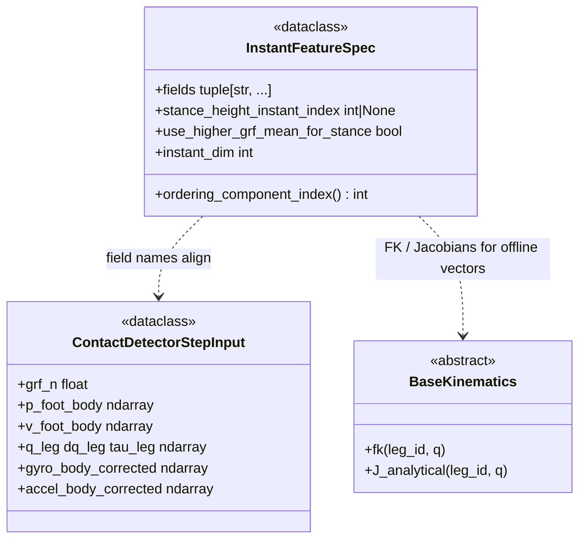

# Features: instant specification and precompute

This package defines the **per-timestep feature vector** used by **GMM+HMM**, **neural contact training**, and the **EKF contact stack** (same field names, compatible layouts). It also hosts the **offline precompute** CLI that writes NumPy bundles for training.

## Modules (no CLI)

| Module | Role |
| ------ | ---- |
| [`instant_spec.py`](instant_spec.py) | Canonical field names, `parse_instant_feature_fields`, `build_timeline_features_for_leg`, helpers shared with `leg_odom.contact.gmm_hmm`. |
| [`discovery.py`](discovery.py) | Discover sequence directories under processed CSV roots (Tartanground / Ocelot). |
| [`sequence_frames.py`](sequence_frames.py) | Load merged `DataFrame` timelines per layout. |
| [`nn_sequence_io.py`](nn_sequence_io.py) | `discover_sequence_dirs`, `load_training_frames` by `dataset.kind`. |
| [`nn_labels_config.py`](nn_labels_config.py) | Validate `labels` block for precompute YAML. |
| [`precompute_config.py`](precompute_config.py) | Load/validate precompute YAML. |
| [`contact_label_timelines.py`](contact_label_timelines.py) | Contact detector replay → per-leg stance (used by precompute). |
| [`__init__.py`](__init__.py) | Re-exports the public names from `instant_spec` for convenience. |

**Consumers:** `leg_odom.contact` (GMM+HMM, neural runtime), `leg_odom.training` (NN/GMM training), `leg_odom.features.precompute_contact_instants`.

## Script: precompute for training

**Entry point:** `python -m leg_odom.features.precompute_contact_instants --config <path.yaml>`

**Purpose:** Walk a tree of raw sequences, load merged timelines per `dataset_kind`, compute full offline instants + foot forces + **stance** (GRF threshold or offline GMM+HMM replay), and write one **`precomputed_instants.npz`** per sequence under `output_root` (mirrored relative paths). Writes **`precompute_manifest.json`** under the output root.

**Requires:** A conda env with project deps. **Does not** import the EKF filter loop.

### Config (YAML)

Copy and edit [`default_precompute_config.yaml`](default_precompute_config.yaml). Required keys:

| Key | Description |
| --- | ----------- |
| `dataset_root` | Processed CSV tree (recursive discovery). |
| `output_root` | Root for mirrored `.npz` tree + manifest (same as training `dataset.precomputed_root`). |
| `dataset_kind` | `tartanground` or `ocelot`. |
| `robot` | `anymal` or `go2` (kinematics for features + stance replay). |
| `labels` | Nested block: `method` + `grf_threshold` or `gmm_hmm` (same structure as historical NN train YAML). |
| `overwrite` | Bool — replace existing npz. |
| `verbose` | Optional bool (default `true`) — tqdm + discovery skips. |
| `max_sequences` | Optional — process only first N after discovery (1–240). |

Frames are **always** validated when loading. There is no `--no-validate`.

### Layout discovery

- **`tartanground`:** each sequence dir has `imu.csv` and exactly one `*_bag.csv`.
- **`ocelot`:** each sequence dir has `lowstate.csv`.

Same rules as [`leg_odom.features.discovery`](discovery.py).

### Outputs

- **`precomputed_instants.npz`** per sequence: `instants_leg*`, `foot_forces`, `stance_leg*`, `contact_label_method`, `contact_labels_config_json`, `sequence_dir`, `robot_kinematics`, format/spec version fields (see [`leg_odom.training.nn.precomputed_io`](../training/nn/precomputed_io.py)).
- **`precompute_manifest.json`**: `config_path`, resolved config snapshot, counts, per-sequence npz paths and UIDs.

## UML class diagrams (Mermaid)

**Spec and shared input contract** — instant field names match [`ContactDetectorStepInput`](../contact/base.py) scalars (and joint slices) used across precompute, training, and EKF.

**Offline CLI** — `precompute_contact_instants` loads YAML via [`precompute_config.py`](precompute_config.py); bundles are consumed by [`precomputed_io`](../training/nn/precomputed_io.py). Full-package UML: [docs/CLASS_DIAGRAM.md](../../docs/CLASS_DIAGRAM.md).

## Downstream dependencies

| Step | Needs precompute? |
| ---- | ----------------- |
| **NN contact training** (`train_contact_nn`) | **Yes** — training reads only npz under `dataset.precomputed_root`. |
| **GMM fit** (`train_gmm`) | **Yes** — same npz discovery (stance arrays are ignored). |
| **EKF with `contact.detector: neural` or `gmm` (online)** | Indirect — needs weights produced **after** training/fit (not the npz at EKF runtime unless you use offline GMM inside the detector). |
| **EKF with `grf_threshold`** | **No** — raw logs only. |

## Related documentation

- [Training README](../training/README.md) — how npz is consumed.
- [Repository README](../../README.md) — full pipeline overview.
- [CLASS_DIAGRAM.md](../../docs/CLASS_DIAGRAM.md) — package-wide classes and factories.
