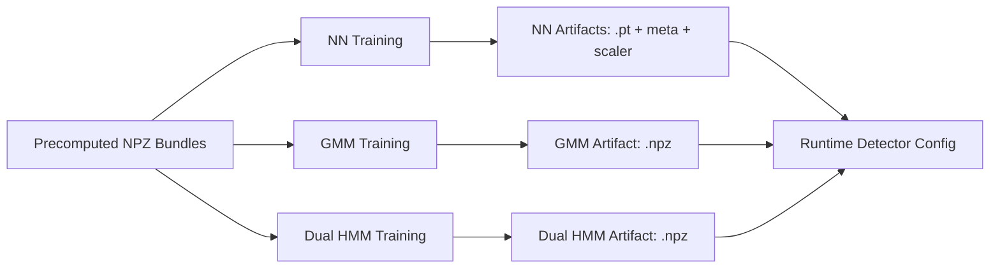

# Training Guide

This module trains contact models used by the Leg Odometry Framework.

Training is needed when you want to run learned detectors (`neural`, `gmm`, `dual_hmm`) with project-specific data.

## Training Scheme



## Submodules

| Path | Purpose |
| ---- | ------- |
| [`nn/`](nn/) | CNN/GRU model training from precomputed bundles |
| [`ssl_nn/`](ssl_nn/) | Self-supervised CNN/GRU training scaffold (training-only, runtime wiring deferred) |
| [`gmm/`](gmm/) | GMM contact model fitting from pooled instant features |
| [`dual_hmm/`](dual_hmm/) | Fused load+kinematic statistical model training |

## Prerequisite

Run preprocessing first (see [`../features/README.md`](../features/README.md)).

Training scripts expect a root containing `precomputed_instants.npz` files.

## Neural Training

Entry point:

```bash
python -m leg_odom.training.nn.train_contact_nn --config leg_odom/training/nn/default_train_config.yaml
```

Outputs typically include:
- model checkpoint (`.pt`),
- model metadata (`_meta.json`),
- feature scaler (`_scaler.npz`),
- optional training plots.

## SSL Neural Training

Entry point:

```bash
python -m leg_odom.training.ssl_nn.train_ssl_nn --config leg_odom/training/ssl_nn/default_ssl_config.yaml
```

This module is intentionally training-only at the moment.
It preserves artifact structure and metadata conventions to ease future detector integration.

## GMM Training

Entry point:

```bash
python -m leg_odom.training.gmm.train_gmm \
  --precomputed-root <precomputed_root>
```

This fits pooled statistical parameters and writes a pretrained `.npz` artifact for runtime use.

## Dual HMM Training

Entry point:

```bash
python -m leg_odom.training.dual_hmm.train_dual_hmm \
  --precomputed-root <precomputed_root>
```

This writes a dual-model `.npz` artifact for fused load+kinematic runtime contact estimation.

## Where Artifacts Live

At the moment, trained artifacts are stored under [`leg_odom/training/`](.) by default.
This storage location may change in future repository organization.

## Wiring Trained Models into EKF Runs

Use experiment YAML to set:
- `contact.detector` to `neural`, `gmm`, or `dual_hmm`,
- detector-specific paths/options under the corresponding config block.

See:
- [`../../config/default_experiment.yaml`](../../config/default_experiment.yaml)
- [`../../config/experiment_parameters_reference.yaml`](../../config/experiment_parameters_reference.yaml)

## Related Docs

- [`../../README.md`](../../README.md)
- [`../features/README.md`](../features/README.md)
- [`../contact/README.md`](../contact/README.md)
