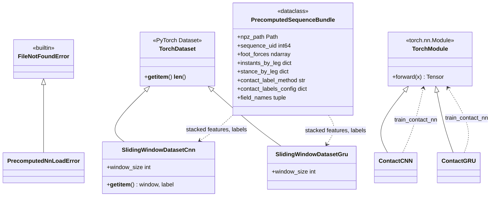

# Training: neural and GMM contact models

This package fits **contact classifiers** and **GMM+HMM** weights from **precomputed** per-sequence features. It does **not** require importing the EKF core; it uses the same **dataset kinds**, **kinematics**, and **merged frames** as the main pipeline.

## Layout

| Path | Role |
| ---- | ---- |
| [`nn/`](nn/) | CNN/GRU training, precomputed I/O (bundles include stance), configs. |
| [`gmm/`](gmm/) | Offline fit of 2-component GMM (+ optional post-train replay plot). |

## UML class diagrams (Mermaid)

**Neural track** — npz I/O (`load_precomputed_sequence_npz`, `discover_precomputed_instants_npz` in [`precomputed_io.py`](nn/precomputed_io.py)), PyTorch `Dataset` windows, and `nn.Module` heads. GMM training ([`train_gmm`](gmm/train_gmm.py)) is mostly procedural but uses the same bundle loader.



Package-wide diagrams: [docs/CLASS_DIAGRAM.md](../../docs/CLASS_DIAGRAM.md).

## Dependency: precompute first

Both tracks expect a directory tree of **`precomputed_instants.npz`** files (see [`leg_odom/features/README.md`](../features/README.md)).

```text
precompute_contact_instants  →  precomputed_instants.npz (tree)
                                      ↓
                          train_contact_nn  /  train_gmm
                                      ↓
                    .pt + meta + scaler  |  .npz weights
                                      ↓
                    experiment YAML (contact.neural / contact.gmm)
```

## Script: neural contact training

**Entry point:** `python -m leg_odom.training.nn.train_contact_nn`

**Purpose:** Load npz bundles from `dataset.precomputed_root` in YAML (precomputed stance timelines); train CNN or GRU; write checkpoint + `_meta.json` + `_scaler.npz`.

### Config

- Default template: [`nn/default_train_config.yaml`](nn/default_train_config.yaml)
- Ocelot + Go2 example: [`nn/default_train_config_ocelot_go2.yaml`](nn/default_train_config_ocelot_go2.yaml)
- **`--config`** path to your YAML (see [`nn/config.py`](nn/config.py) for validation rules).

Key sections: `dataset.kind`, `dataset.precomputed_root`, `robot.kinematics`, `architecture` (`cnn`/`gru`), `features.fields`, `training.*`, `model.window_size`, `data_loading.verbose`, `visualization` (`enabled`, `num_train_sections`, `num_test_sections`, `dpi`).

**Plots:** `output.dir/plots/<stem>_training_curves.png` is refreshed every epoch. If `visualization.enabled` is true and the dataset has a test split, then **whenever the best checkpoint improves** the run also writes `output.dir/plots/samples/<stem>_epoch_<k>.png` with random windows labeled `[train]` vs `[test]` (defaults: two of each) so train–test gaps are easy to see. `_meta.json` stores `test_sample_plots_dir` and `test_sample_plot_latest`.

### Supporting modules (library, not CLIs)

| Module | Role |
| ------ | ---- |
| [`features/discovery.py`](../features/discovery.py) | Discover sequence dirs under a processed CSV tree (precompute). |
| [`features/nn_sequence_io.py`](../features/nn_sequence_io.py) | Dispatch frame load / discovery by `dataset.kind` for precompute. |
| [`features/contact_label_timelines.py`](../features/contact_label_timelines.py) | Stance timelines via `build_leg_odometry_dataset` + contact replay (precompute). |
| [`nn/precomputed_io.py`](nn/precomputed_io.py) | Load/save contract for npz bundles. |
| [`nn/data.py`](nn/data.py) | PyTorch `Dataset` assembly, sliding windows. |
| [`nn/models.py`](nn/models.py) | `ContactCNN`, `ContactGRU`. |

## Script: GMM training

**Entry point:** `python -m leg_odom.training.gmm.train_gmm`

**Purpose:** Stack sliding-window features from all `precomputed_instants.npz` under `--precomputed-root`, fit ordered 2-GMM, save **`.npz`** for online HMM (`train_gmm.py` docstring lists full CLI).

### Common arguments

| Argument | Description |
| -------- | ----------- |
| `--precomputed-root` | Tree containing `precomputed_instants.npz`. |
| `--output` | Output `.npz` path (default under `leg_odom/training/gmm/`). |
| `--robot-kinematics` | `anymal` or `go2` (must match precompute). |
| `--feature-fields` | Comma-separated instant field names. |
| `--history-length` | Default `1` (required for offline GMM mode in EKF). |
| `--max-sequences` | Optional cap for quick runs. |
| `--skip-train-plot` | Skip replay figure after training. |

## Outputs and EKF wiring

- **NN:** Point `contact.detector: neural` and `contact.neural.checkpoint` (+ scaler/meta paths) in experiment YAML — see [`leg_odom/run/experiment_config.py`](../run/experiment_config.py) and [`leg_odom/run/contact_factory.py`](../run/contact_factory.py).
- **GMM:** Point `contact.detector: gmm` and pretrained npz / mode (`offline` vs `online`) per project conventions — see ARCHITECTURE / config reference.

## Eval CLIs (post-EKF, optional)

Not part of training, but useful after a full run:

```bash
python -m leg_odom.eval.trajectory_eval --help
python -m leg_odom.eval.analysis_plots --help
```

## Related documentation

- [Features README](../features/README.md) — precompute CLI.
- [Contact README](../contact/README.md) — how detectors consume weights at runtime.
- [Repository README](../../README.md) — main EKF entrypoint.
- [CLASS_DIAGRAM.md](../../docs/CLASS_DIAGRAM.md) — datasets, contact ABC, EKF, factories.
